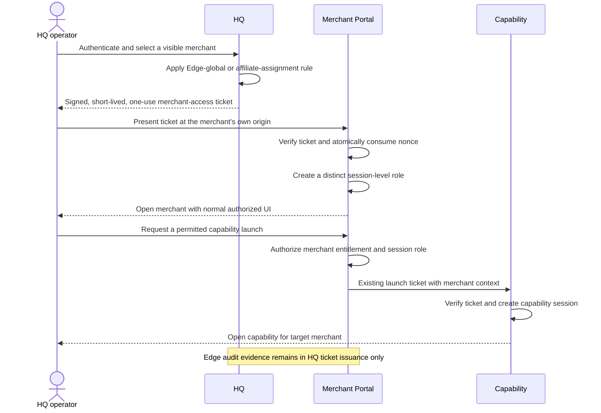

# HQ Architecture

## Product boundary

HQ is the cross-merchant management product for Edge and affiliate organisations. Merchant Portal is the control plane for exactly one merchant deployment. Capabilities remain independently deployed applications entered only through Merchant Portal.

HQ and Merchant Portal do not share authentication, cookies, sessions, routes, or user records. Merchant Portal has no business selector and no `/hq` route area. An HQ operator is never represented as a merchant Owner, merchant user, or `BusinessMembership` member.

HQ authentication uses a unique, case-normalised username, password, and
required TOTP MFA. First-deployment setup is complete only after the master
administrator has confirmed the password and verified the authenticator code.
A normal HQ session is created only after both password and MFA verification;
the intermediate MFA challenge is short-lived and cannot access HQ routes. See
[`../decisions/0011-hq-username-and-mfa.md`](../decisions/0011-hq-username-and-mfa.md).

## Visibility

- Edge HQ sees every business in the HQ directory, including `PROVISIONING` entries.
- An affiliate HQ sees only businesses with an active `HQBusinessAssignment` for that HQ.
- An HQ membership grants visibility only through its HQ; it grants no merchant membership.
- Merchant users see only their own Merchant Portal and cannot use HQ routes or HQ merchant-access tickets.

Every list and ticket-issuance request repeats this authorization check. Selecting or guessing a business identifier is not sufficient.

## Merchant entry

An HQ directory entry is created manually from a business name, slug, Portal URL, and status. This operation creates only the directory record; it does not create files, repositories, Vercel projects, databases, or domains. Those remain manual steps in the merchant checklist.

An Edge HQ administrator may change only the directory status between `PROVISIONING` and `READY`. The change and an audit event containing the merchant, previous and new status, HQ operator, and timestamp are persisted atomically. This is not general merchant editing.

Only a `READY` entry with a Portal URL can be opened. After authorization and that readiness check, HQ creates a short-lived, asymmetrically signed, one-use merchant-access ticket for one exact merchant Portal origin. The ticket includes the issuing HQ, operator, target business, target origin, access mode, issued time, expiry, nonce, and audit identifier. Its type, audience, key, and nonce lifecycle are distinct from capability launch tickets.

The target Merchant Portal validates the signature, issuer, ticket type, audience, target business, exact target origin, issued time, expiry, and nonce. It atomically consumes the nonce into `HQAccessTicketNonce` before creating an opaque, merchant-local `HQSupportSession`. Failed tickets create no session. A merchant-user request cannot exchange a ticket, and a merchant user cannot issue one.

An `EDGE_FULL_ACCESS` session is presented like normal authorized use, with no
banner or HQ-access indicator. It is still a distinct session-level role and is
never represented as the merchant Owner or as a `BusinessMembership`.

## Authorization and audit

The HQ-managed session records its access mode. Merchant Portal authorizes every request against that mode; possession of the session alone does not imply Owner or Admin permissions.

`EDGE_FULL_ACCESS` grants Edge operators full business, user, and application
management. Affiliate sessions continue to use `SUPPORT_READ_ONLY`. See
[`../decisions/0009-sprint-1-merchant-setup-access.md`](../decisions/0009-sprint-1-merchant-setup-access.md).

HQ records ticket issuance. For `EDGE_FULL_ACCESS`, Merchant Portal retains only
the opaque session and consumed nonce required for authentication and replay
prevention. It creates no merchant-side audit event, action record, activity log,
or UI history for the Edge session. Affiliate support-session auditing is
unchanged.

Merchant deployments run a daily authenticated cleanup. It deletes expired
`HQSupportSession` rows and consumed `HQAccessTicketNonce` rows older than 30
days. Active sessions, newer nonce evidence, and `HQAccessAuditEvent` rows are
not deleted.

## End-to-end sequence

## Remaining architectural questions

1. Name the authoritative source and lifecycle for the HQ business directory and `HQBusinessAssignment` records, including assignment approval and removal.
2. Define ticket signing-key publication, rotation, overlap, and emergency revocation for merchant deployments.
3. Decide whether expiry or termination of an HQ-managed Merchant Portal session must terminate an already-created capability session; capability sessions are otherwise independent by design.
